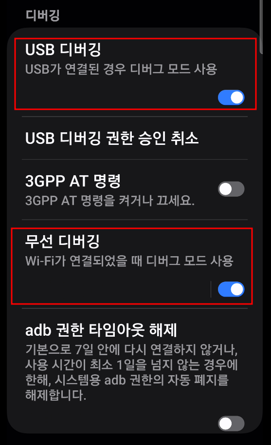
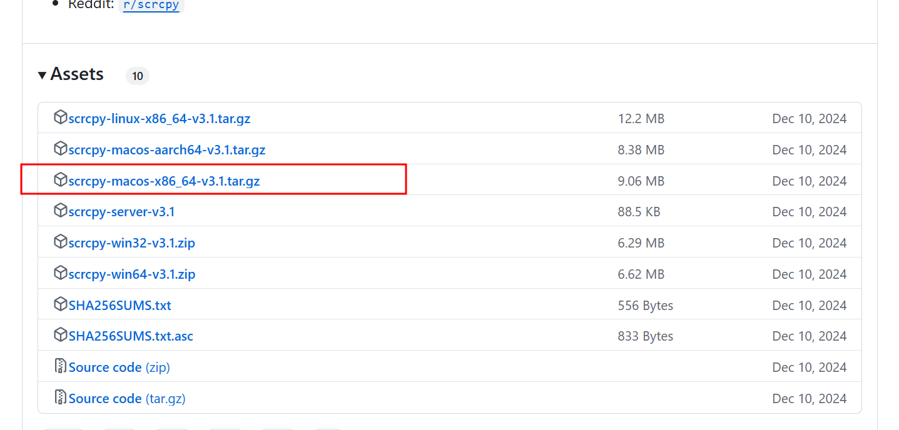
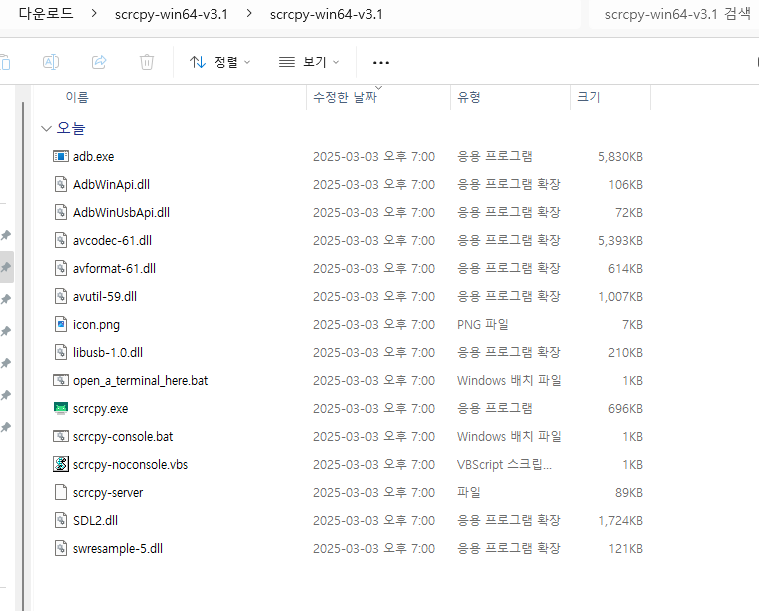
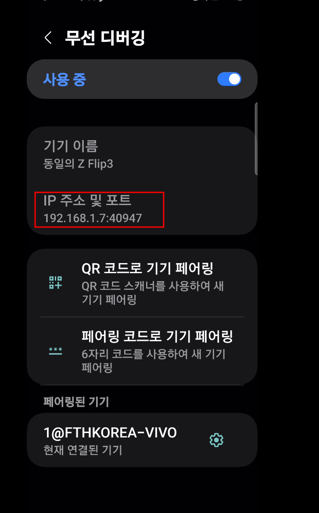
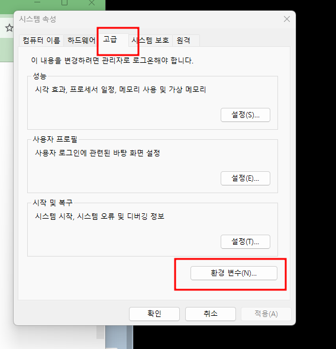
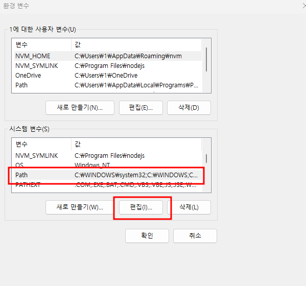
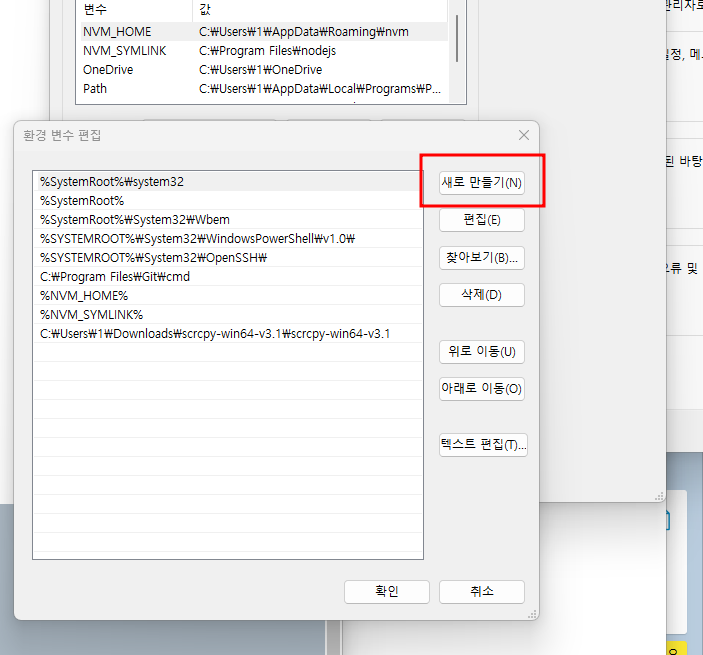
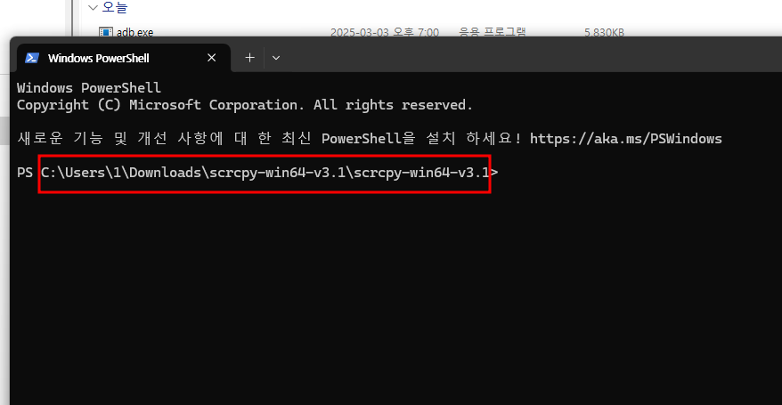
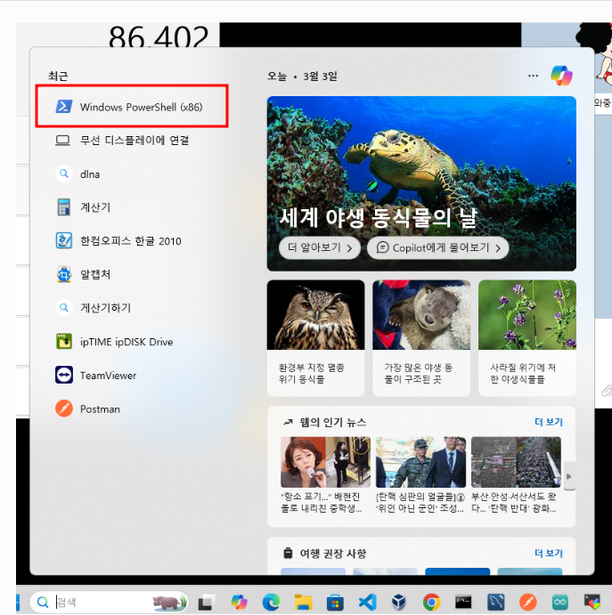
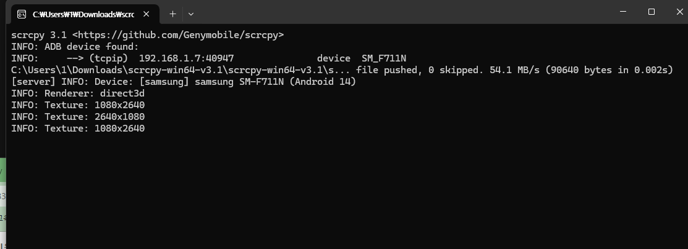

## 스마트폰(android)와 window 연결 하기

스마트 폰과 윈도우를 연결 하기 위해선 우선 2가지 방법이 있다. 

USB 케이블을 사용한 유선 연결 과 동일 wifi 상에서의 무선 연결 

### 공통 작업 

#### 1. 안드로이드 에서 개발자 모드로 접근 

    📲 개발자 모드(개발자 옵션) 활성화 방법
    설정 앱 열기
    휴대전화 정보 메뉴로 이동
    설정 화면 아래쪽에 있어요.
    소프트웨어 정보로 이동
    빌드번호 항목을 빠르게 7번 터치
    터치할 때마다 "개발자 모드가 X단계 남았습니다" 같은 안내가 나옵니다.
    화면 잠금 비밀번호 입력 (설정되어 있을 경우)
    개발자 모드 활성화 완료!
    ✅ 이제, 설정 맨 아래에 "개발자 옵션" 메뉴가 생깁니다.

 개발자 모드로 접근 해서 사진 과 같이 활성화를 해 준다.

그러면 스마트 폰에서 설정 하는 작업은 끝. 

#### 2. PC에서 소프트웨어 다운 로드 및 환경 설정 

        https://github.com/Genymobile/scrcpy/releases
위의 사이트로 이동 해서 

이 내용을 다운 받고 압축을 해제 한다. 

나 같은 경우 그냥 다운로드 폴더로 정해 놨음. 

#### 3.유선 케이블로 연결 하기 

    scrcpy.exe 를 실행 하면 ( USB 연결 후에 ) PC화면에 내 모바일 환경이 나타 난다. 

#### 4. 무선 연결 하기 

        📡 무선 디버그 (Wireless Debugging)란?
        보통 스마트폰을 PC랑 연결해서 개발자 도구(adb) 같은 걸 쓰려면,
        USB 케이블로 스마트폰과 PC를 연결해야 하잖아요?
        
        그런데 무선 디버그는 USB 없이 Wi-Fi로 PC와 스마트폰을 연결하는 방법이에요.
        즉, 케이블 없이 무선으로 디버그(개발자 모드 기능)를 쓸 수 있는 기능입니다.
        
        원래 쓰는 목적
        개발자가 앱을 테스트할 때, 매번 USB 꽂기 귀찮으니까 Wi-Fi로 연결하고 디버그하는 용도
        📺 무선 디버그로 화면 미러링도 가능할까?
        ✅ 가능합니다!
        Scrcpy 같은 프로그램도 원래 USB 연결로 쓰지만, 무선 디버그를 설정하면 케이블 없이 Wi-Fi로 스마트폰 화면을 PC에 띄울 수 있어요.

 ##### 1) 스마트폰 개발자 모드에서 무선 디버깅 을 눌러 준다. (붉은색으로 표시 한게 나의 ip와 포트 
 

이걸 기억 하고 다시 PC로 이동 해서 

##### ✅ 환경변수에 ADB 경로 등록 방법
        Windows 키 + R → sysdm.cpl 입력 후 엔터
        "고급" 탭 → 하단의 "환경 변수" 클릭
        시스템 변수 목록에서 Path 선택 후 "편집"
        "새로 만들기" 클릭하고, ADB가 있는 폴더 경로 추가
        예시: C:\platform-tools\
        확인 → 확인 → 적용

 

여기에 ADB가 등록된 path 를 입력 후 저장 한다. 

#### 5. powershell 로 adb 실행 하기 

사전에 내가 스마트 폰에서 확인한 무선 USB 디버그 에서의 ip와 port를 입력 

