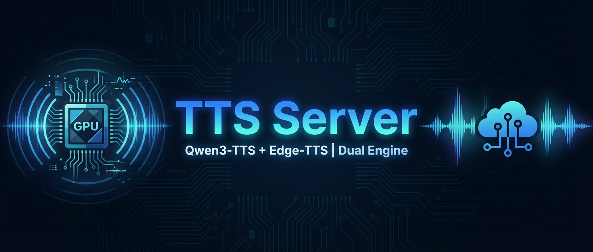
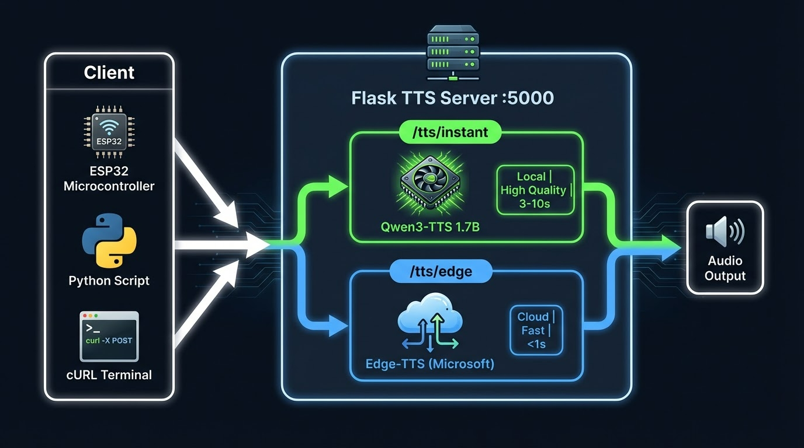
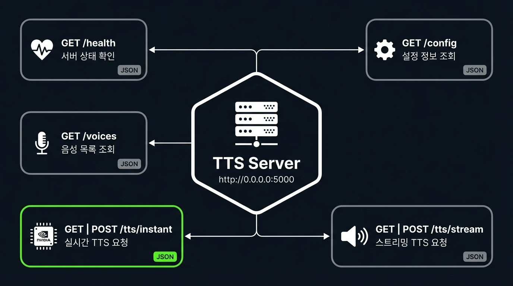
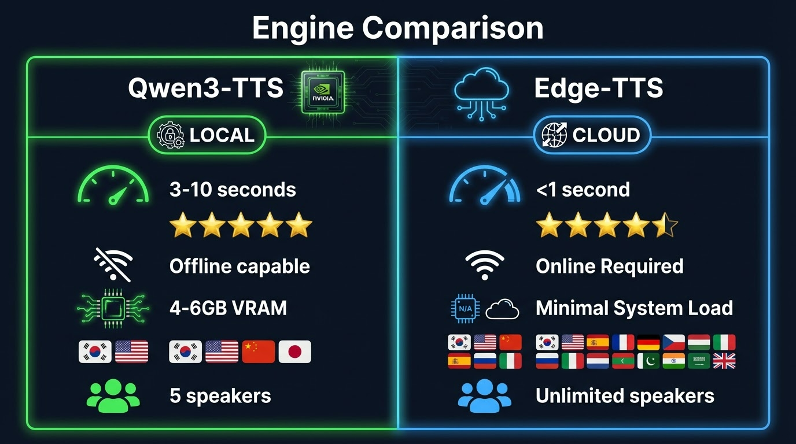

# 🔊 TTS Server (Qwen3-TTS + Edge-TTS)
<!-- 히어로 배너 -->

Flask 기반의 **듀얼 엔진 Text-to-Speech 서버**입니다.  
고품질 로컬 AI 모델(**Qwen3-TTS**)과 빠른 클라우드 TTS(**Edge-TTS**)를 하나의 서버에서 동시에 제공합니다.  
출력은 **WAV 16bit 24kHz mono** 형식으로, ESP32 등 임베디드 디바이스와의 호환을 고려하여 설계되었습니다.

---

## 📋 목차

- [아키텍처](#-아키텍처)
- [시스템 요구사항](#-시스템-요구사항)
- [설치](#-설치)
- [실행](#-실행)
- [API 레퍼런스](#-api-레퍼런스)
  - [GET /health](#get-health)
  - [GET /config](#get-config)
  - [GET /voices](#get-voices)
  - [GET | POST /tts/instant](#get--post-ttsinstant---qwen3-tts)
  - [GET | POST /tts/edge](#get--post-ttsedge---edge-tts)
- [사용 예시](#-사용-예시)
- [로그](#-로그)
- [엔진 비교](#-엔진-비교)
- [프로젝트 구조](#-프로젝트-구조)
- [트러블슈팅](#-트러블슈팅)
- [라이선스](#-라이선스)

---

## 🏗 아키텍처

```text
┌──────────────────────────────────────────────────────────┐
│                    TTS Server (:5000)                     │
│                         Flask                            │
│                                                          │
│  ┌──────────────────────┐  ┌───────────────────────────┐ │
│  │   /tts/instant       │  │   /tts/edge               │ │
│  │                      │  │                           │ │
│  │   Qwen3-TTS          │  │   Edge-TTS (Microsoft)    │ │
│  │   1.7B 파라미터      │  │   → MP3 → FFmpeg          │ │
│  │   GPU (CUDA)         │  │   → WAV 변환              │ │
│  │   고품질 / 느림      │  │   빠름 / 클라우드         │ │
│  └──────────┬───────────┘  └──────────────┬────────────┘ │
│             │                             │              │
│             ▼                             ▼              │
│        WAV 16bit 24kHz mono         WAV 16bit 24kHz mono │
│                   (ESP32 호환 출력)                       │
└──────────────────────────────────────────────────────────┘
```

---

## 💻 시스템 요구사항


| 항목 | 사양 |
|------|------|
| **OS** | Ubuntu 22.04 LTS |
| **GPU** | NVIDIA RTX 3060 (VRAM 16GB) |
| **CUDA** | 11.8 이상 |
| **Python** | 3.10 이상 |
| **FFmpeg** | 필수 (Edge-TTS WAV 변환용) |
| **네트워크** | Edge-TTS 사용 시 인터넷 연결 필요 |

> [!NOTE]
> Qwen3-TTS-12Hz-1.7B 모델은 `bfloat16` 정밀도로 로드되며, 약 **4~6GB VRAM**을 사용합니다.  
> RTX 3060 16GB 환경에서 안정적으로 동작합니다.

---

## 📦 설치

### 1. 시스템 패키지

```bash
sudo apt update
sudo apt install -y ffmpeg
```

### 2. Python 가상 환경 생성

```bash
python3 -m venv venv
source venv/bin/activate
```

### 3. Python 패키지 설치

```bash
pip install --upgrade pip
pip install flask torch soundfile edge-tts qwen-tts
```

> [!IMPORTANT]
> CUDA 버전에 맞는 PyTorch를 설치해야 합니다.  
> 공식 가이드: [https://pytorch.org/get-started/locally/](https://pytorch.org/get-started/locally/)

```bash
# 예시: CUDA 11.8
pip install torch --index-url https://download.pytorch.org/whl/cu118
```

### 4. 모델 다운로드 (최초 실행 시 자동)

서버 최초 실행 시 `Qwen/Qwen3-TTS-12Hz-1.7B-CustomVoice` 모델이 Hugging Face에서 자동 다운로드됩니다.  
사전 다운로드를 원할 경우:

```bash
huggingface-cli download Qwen/Qwen3-TTS-12Hz-1.7B-CustomVoice
```

---

## 🚀 실행

```bash
# 가상 환경 활성화
source venv/bin/activate

# 서버 실행
python tts_server.py
```

정상 실행 시 출력:

```text
==================================================
Qwen3-TTS 모델 로드 중...
✓ Qwen3-TTS 모델 로드 완료
✓ TTS 서버 시작
  출력: WAV 16bit 16kHz mono
  주소: http://0.0.0.0:5000
==================================================
```

### systemd 서비스 등록 (선택)

`/etc/systemd/system/tts-server.service` 파일을 생성합니다:

```ini
[Unit]
Description=TTS Server (Qwen3 + Edge)
After=network.target

[Service]
Type=simple
User=your_user
WorkingDirectory=/path/to/tts-server
ExecStart=/path/to/venv/bin/python tts_server.py
Restart=on-failure
RestartSec=10
Environment=CUDA_VISIBLE_DEVICES=0

[Install]
WantedBy=multi-user.target
```

```bash
sudo systemctl daemon-reload
sudo systemctl enable --now tts-server
```

---

## 📖 API 레퍼런스



### `GET /health`

서버 상태를 확인합니다.

**요청:**

```http
GET /health HTTP/1.1
Host: localhost:5000
```

**응답:**

```json
{
  "status": "healthy",
  "qwen_model_loaded": true,
  "device": "cuda:0",
  "edge_tts": "available"
}
```

---

### `GET /config`

서버 설정 및 엔드포인트 정보를 반환합니다.

**요청:**

```http
GET /config HTTP/1.1
Host: localhost:5000
```

**응답:**

```json
{
  "service": "TTS Server (Qwen3 + Edge)",
  "output": "WAV 16bit 16kHz mono (ESP32 호환)",
  "endpoints": {
    "/tts/instant": "Qwen3-TTS (느림, 고품질)",
    "/tts/edge": "Edge-TTS (빠름)"
  }
}
```

---

### `GET /voices`

사용 가능한 음성 목록을 반환합니다.

**요청:**

```http
GET /voices HTTP/1.1
Host: localhost:5000
```

**응답:**

```json
{
  "qwen": {
    "speakers": ["Sohee", "Vivian", "Serena", "Ryan", "Aiden"]
  },
  "edge": {
    "voices": {
      "sunhi": "ko-KR-SunHiNeural",
      "injoon": "ko-KR-InJoonNeural",
      "hyunsu": "ko-KR-HyunsuNeural",
      "jenny": "en-US-JennyNeural",
      "guy": "en-US-GuyNeural",
      "xiaoxiao": "zh-CN-XiaoxiaoNeural",
      "nanami": "ja-JP-NanamiNeural"
    }
  }
}
```

---

### `GET | POST /tts/instant` — Qwen3-TTS

**Qwen3-TTS** 엔진으로 음성을 생성합니다.  
GPU에서 추론하며 고품질 음성을 반환합니다.

#### 파라미터

| 파라미터 | 타입 | 필수 | 기본값 | 설명 |
|----------|------|------|--------|------|
| `text` | string | ✅ | — | 변환할 텍스트 |
| `language` | string | ❌ | `Korean` | 언어 (`Korean`, `English`, `Chinese`, `Japanese`) |
| `speaker` | string | ❌ | `Sohee` | 화자 (`Sohee`, `Vivian`, `Serena`, `Ryan`, `Aiden`) |

#### GET 요청

```http
GET /tts/instant?text=안녕하세요&language=Korean&speaker=Sohee HTTP/1.1
Host: localhost:5000
```

#### POST 요청

```http
POST /tts/instant HTTP/1.1
Host: localhost:5000
Content-Type: application/json

{
  "text": "안녕하세요, 반갑습니다.",
  "language": "Korean",
  "speaker": "Ryan"
}
```

#### 응답

| 항목 | 값 |
|------|-----|
| **Content-Type** | `audio/wav` |
| **포맷** | WAV 16bit PCM |

#### 에러 응답

```json
{ "error": "text 필수" }          // 400 - text 미입력
{ "error": "모델 미로드" }         // 500 - 모델 로드 실패
{ "error": "에러 상세 메시지" }    // 500 - 기타 오류
```

---

### `GET | POST /tts/edge` — Edge-TTS

**Edge-TTS** (Microsoft) 엔진으로 음성을 생성합니다.  
클라우드 기반으로 빠른 응답을 반환합니다.

#### 파라미터

| 파라미터 | 타입 | 필수 | 기본값 | 설명 |
|----------|------|------|--------|------|
| `text` | string | ✅ | — | 변환할 텍스트 |
| `voice` | string | ❌ | `ko-KR-SunHiNeural` | 음성 (단축키 또는 전체 이름) |

#### 음성 단축키 매핑

| 단축키 | 전체 이름 | 언어 |
|--------|-----------|------|
| `sunhi` | `ko-KR-SunHiNeural` | 🇰🇷 한국어 (여성) |
| `injoon` | `ko-KR-InJoonNeural` | 🇰🇷 한국어 (남성) |
| `hyunsu` | `ko-KR-HyunsuNeural` | 🇰🇷 한국어 (남성) |
| `jenny` | `en-US-JennyNeural` | 🇺🇸 영어 (여성) |
| `guy` | `en-US-GuyNeural` | 🇺🇸 영어 (남성) |
| `xiaoxiao` | `zh-CN-XiaoxiaoNeural` | 🇨🇳 중국어 (여성) |
| `nanami` | `ja-JP-NanamiNeural` | 🇯🇵 일본어 (여성) |

#### GET 요청

```http
GET /tts/edge?text=안녕하세요&voice=hyunsu HTTP/1.1
Host: localhost:5000
```

#### POST 요청

```http
POST /tts/edge HTTP/1.1
Host: localhost:5000
Content-Type: application/json

{
  "text": "Hello, this is a test.",
  "voice": "jenny"
}
```

#### 응답

| 항목 | 값 |
|------|-----|
| **Content-Type** | `audio/wav` |
| **포맷** | WAV 16bit 24kHz mono PCM |

#### 에러 응답

```json
{ "error": "text 필수" }          // 400 - text 미입력
{ "error": "생성 실패" }          // 500 - Edge-TTS 또는 FFmpeg 오류
{ "error": "에러 상세 메시지" }    // 500 - 기타 오류
```

---

## 🧪 사용 예시

### cURL

```bash
# ── Qwen3-TTS ────────────────────────────────────────

# GET 방식
curl "http://localhost:5000/tts/instant?text=안녕하세요&language=Korean&speaker=Sohee" \
  --output output_qwen.wav

# POST 방식
curl -X POST http://localhost:5000/tts/instant \
  -H "Content-Type: application/json" \
  -d '{"text": "안녕하세요, 반갑습니다.", "language": "Korean", "speaker": "Ryan"}' \
  --output output_qwen.wav

# ── Edge-TTS ─────────────────────────────────────────

# GET 방식 (단축키 사용)
curl "http://localhost:5000/tts/edge?text=빠른+음성+합성+테스트&voice=hyunsu" \
  --output output_edge.wav

# POST 방식
curl -X POST http://localhost:5000/tts/edge \
  -H "Content-Type: application/json" \
  -d '{"text": "Hello, this is a test.", "voice": "jenny"}' \
  --output output_edge.wav

# ── 상태 확인 ────────────────────────────────────────

curl http://localhost:5000/health
curl http://localhost:5000/config
curl http://localhost:5000/voices
```

### Python (requests)

```python
import requests

# ── Qwen3-TTS ──
response = requests.post("http://localhost:5000/tts/instant", json={
    "text": "오늘 날씨가 정말 좋네요.",
    "language": "Korean",
    "speaker": "Sohee"
})

with open("output_qwen.wav", "wb") as f:
    f.write(response.content)

# ── Edge-TTS ──
response = requests.get("http://localhost:5000/tts/edge", params={
    "text": "빠른 응답이 필요할 때 사용합니다.",
    "voice": "sunhi"
})

with open("output_edge.wav", "wb") as f:
    f.write(response.content)
```

### ESP32 (Arduino)

```cpp
#include <HTTPClient.h>
#include <WiFi.h>

void requestTTS(const char* text) {
    HTTPClient http;

    String url = String("http://YOUR_SERVER_IP:5000/tts/edge?text=")
               + String(text)
               + "&voice=sunhi";

    http.begin(url);
    int httpCode = http.GET();

    if (httpCode == 200) {
        WiFiClient* stream = http.getStreamPtr();
        // WAV 16bit 24kHz mono → I2S 출력으로 전달
    }

    http.end();
}
```

---

## 📝 로그

로그는 두 곳에 동시 출력됩니다.

| 출력 위치 | 설명 |
|-----------|------|
| `../logs/tts.log` | 파일 로그 (영구 보관) |
| `stdout` (터미널) | 콘솔 출력 (실시간 확인) |

> [!NOTE]
> 로그 디렉토리 `../logs/`는 서버 시작 시 자동 생성됩니다.

**로그 출력 예시:**

```text
2026-02-19 14:30:01 - INFO - [Qwen3] 안녕하세요, 오늘 날씨가 좋네요...
2026-02-19 14:30:05 - INFO - ✓ [Qwen3] 완료
2026-02-19 14:30:06 - INFO - [Edge] 빠른 테스트입니다...
2026-02-19 14:30:07 - INFO - ✓ [Edge] 완료: 48256 bytes
```

---

## ⚖ 엔진 비교



| 항목 | Qwen3-TTS (`/tts/instant`) | Edge-TTS (`/tts/edge`) |
|------|:---:|:---:|
| **실행 위치** | 로컬 GPU | Microsoft 클라우드 |
| **응답 속도** | 느림 (3~10초) | 빠름 (<1초) |
| **음성 품질** | ⭐⭐⭐⭐⭐ 고품질 | ⭐⭐⭐⭐ 양호 |
| **인터넷 필요** | ❌ 불필요 | ✅ 필요 |
| **지원 언어** | 한 / 영 / 중 / 일 | 다국어 (음성별) |
| **화자 수** | 5종 | 7종 |
| **VRAM 사용** | 약 4~6GB | 0 |
| **출력 포맷** | WAV 16bit PCM | WAV 16bit 24kHz mono PCM |
| **오프라인 사용** | ✅ 가능 | ❌ 불가 |

---

## 📁 프로젝트 구조

```text
tts-server/
├── tts_server.py          # 메인 서버 애플리케이션
├── requirements.txt       # Python 의존성 목록
├── README.md              # 이 문서
└── ../logs/
    └── tts.log            # 런타임 로그 (자동 생성)
```

### requirements.txt

```text
flask
torch
soundfile
edge-tts
qwen-tts
```

---

## 🔧 트러블슈팅

### ❌ CUDA out of memory

```text
torch.cuda.OutOfMemoryError: CUDA out of memory
```

Qwen3-TTS는 bfloat16으로 약 4~6GB VRAM을 사용합니다. 다른 GPU 프로세스가 메모리를 점유하고 있는지 확인하세요.

```bash
nvidia-smi
# 불필요한 프로세스 종료
kill -9 <PID>
```

---

### ❌ FFmpeg not found

```text
FileNotFoundError: [Errno 2] No such file or directory: 'ffmpeg'
```

```bash
sudo apt install -y ffmpeg
ffmpeg -version   # 설치 확인
```

---

### ❌ Edge-TTS 타임아웃 / 네트워크 오류

Edge-TTS는 Microsoft 클라우드 서비스를 사용합니다.

```bash
# 인터넷 연결 확인
ping -c 3 speech.platform.bing.com

# 방화벽 확인 (HTTPS 443 포트)
sudo ufw status
```

---

### ❌ Qwen3-TTS 모델 다운로드 실패

Hugging Face 접속이 불안정할 경우 미러를 사용할 수 있습니다.

```bash
export HF_ENDPOINT=https://hf-mirror.com
python tts_server.py
```

또는 수동 다운로드:

```bash
huggingface-cli download Qwen/Qwen3-TTS-12Hz-1.7B-CustomVoice \
  --local-dir ./models/qwen3-tts
```

---

### ❌ 포트 충돌

```text
OSError: [Errno 98] Address already in use
```

```bash
# 5000번 포트를 사용 중인 프로세스 확인
sudo lsof -i :5000
kill -9 <PID>
```

---

## 📄 라이선스

본 프로젝트는 아래 외부 리소스를 사용합니다. 각 라이선스를 준수하세요.

| 리소스 | 라이선스 |
|--------|----------|
| [Qwen3-TTS](https://huggingface.co/Qwen/Qwen3-TTS-12Hz-1.7B-CustomVoice) | Qwen License |
| [Edge-TTS](https://github.com/rany2/edge-tts) | MIT |
| [Flask](https://github.com/pallets/flask) | BSD-3-Clause |
| [PyTorch](https://github.com/pytorch/pytorch) | BSD-3-Clause |
| [SoundFile](https://github.com/bastibe/python-soundfile) | BSD-3-Clause |
