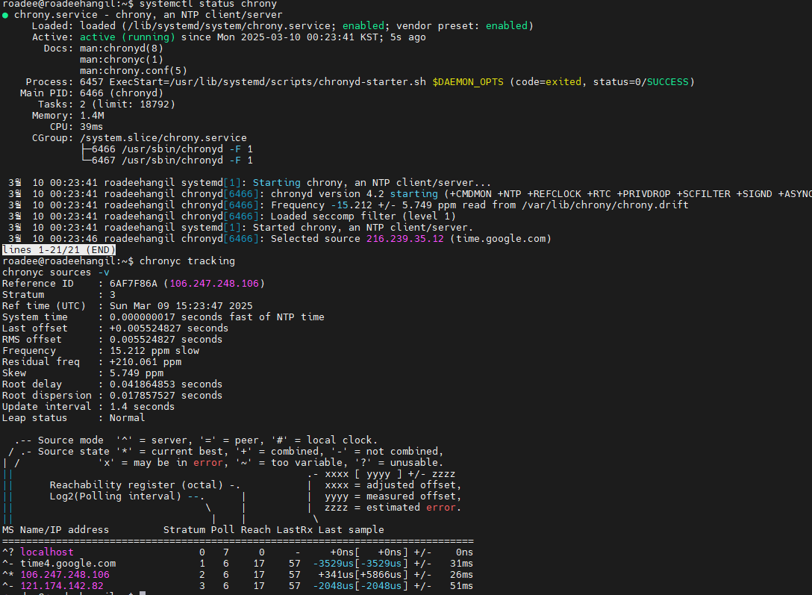
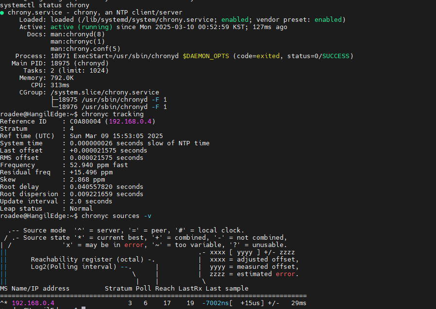

우분투 서버에서 시간을 동기화 시키고 로컬 서버 와 클라이언트를 다시 시간 동기화 시키는 방법은 2가지로 설정 해야 한다. 

### 1. NTP(Network Time Protocol) 서버를 설치하고 설정하는 방법

   설치 하는 방법은 2가지가 있는데 chrony 또는 ntpd를 사용

#### 1) chrony 설치  

    sudo apt update
    
    sudo apt install chrony -y

이렇게 하고 환경 설정 으로 들어 간다.

      sudo nano /etc/chrony/chrony.conf

      # Chrony Configuration File
      # 로컬 Chrony 서버 설정
      
      server 127.127.1.0 iburst
      local stratum 10
      
      # 외부 NTP 서버 (인터넷 연결 시)
      server time.google.com iburst
      server 0.pool.ntp.org iburst
      server 1.pool.ntp.org iburst
      
      # 로컬 네트워크에서 NTP 서비스 허용
      allow 192.168.0.0/24
      
      # 시스템이 인터넷에 연결되지 않았을 때 RTC 동기화 사용
      # rtcfile /var/lib/chrony/rtc
      
      # 드리프트 파일 저장 위치
      driftfile /var/lib/chrony/chrony.drift
      
      # 시간 조정 설정
      makestep 1 3
      
      # 로그 설정
      logdir /var/log/chrony
      
      # 11분마다 커널 RTC 동기화 활성화
      rtcsync

#### 2. Chrony 동기화 상태 확인
 
      sudo systemctl restart chrony
      
      systemctl status chrony

#### 3.chronyc tracking, chronyc sources -v 분석 

      Reference ID    : 6AF7F86A (106.247.248.106)  # 현재 참조하는 NTP 서버
      
      Stratum         : 3                            # 현재 동기화된 Stratum 레벨
      
      Ref time (UTC)  : Sun Mar 09 15:23:47 2025    # 마지막 동기화된 시간 (UTC)
      
      System time     : 0.000000017 seconds fast    # 현재 시스템 시간과 NTP 시간 차이
      
      Last offset     : +0.005524827 seconds        # 마지막으로 보정된 오차
      
      RMS offset      : 0.005524827 seconds         # 보정된 오차의 평균값
      
      Frequency       : 15.212 ppm slow             # 시스템 클럭 주파수 조정값
      
      Residual freq   : +210.061 ppm                # 남은 주파수 보정값
      
      Skew            : 5.749 ppm                   # 예상 오차
      
      Root delay      : 0.041864853 seconds         # NTP 서버까지 왕복 지연 시간
      
      Root dispersion : 0.017857527 seconds         # 루트 분산(오차율)
      
      Update interval : 1.4 seconds                 # NTP 업데이트 간격
      
      Leap status     : Normal                      # 정상 상태

      ➡ 현재 106.247.248.106 (Stratum 2) 서버와 정상적으로 동기화됨
      ➡ 시스템 클럭이 안정적으로 유지되고 있음

      MS Name/IP address         Stratum Poll Reach LastRx Last sample
      
      ===============================================================================
      
      ^? localhost                     0   7     0     -     +0ns[   +0ns] +/-    0ns
      
      ^- time4.google.com              1   6    17    57  -3529us[-3529us] +/-   31ms
      
      ^* 106.247.248.106               2   6    17    57   +341us[+5866us] +/-   26ms
      
      ^- 121.174.142.82                3   6    17    57  -2048us[-2048us] +/-   51ms

      MS: ^*(현재 선택된 서버), ^-(보조 서버), ^?(사용 불가능한 서버)
      Stratum: 서버의 Stratum 레벨 (숫자가 낮을수록 더 정확함)
      Poll: 시간 동기화 간격 (2^Poll 초)
      Reach: 서버의 가용성 (8비트 0~377, 높을수록 좋음)
      LastRx: 마지막 동기화 시간(초)
      Last sample: 마지막 샘플 오차값 및 조정값
        
      ✅ ^* 106.247.248.106 (Stratum 2) 서버가 현재 최적의 동기화 서버로 선택됨
      ✅ ^- time4.google.com (Stratum 1)이 보조 서버로 사용 중
      ✅ ^- 121.174.142.82 (Stratum 3)도 연결되어 있지만 우선순위가 낮음
      ❌ ^? localhost는 Reach 값이 0이므로 사용할 수 없음
      
#### 🎯 추가 조치 (선택)

      RTC(하드웨어 클럭) 동기화 확인
      hwclock --show
      만약 시스템 시간이 RTC와 맞지 않으면 아래 명령어 실행:
      sudo hwclock --systohc
      
### 2. 클라이언트 설치 하기 

#### 1) 소프트웨어설치 

      sudo apt update 
      
      sudo apt install chrony -y

#### 2) 환경 설정 

      sudo nano /etc/chrony/chrony.conf

      # 클라이언트의 Chrony 설정
      
      # 내부 네트워크 NTP 서버 (192.168.0.4) 사용
      server 192.168.0.4 iburst prefer
      
      # (선택 사항) 외부 NTP 서버를 백업으로 추가 가능
      # server time.google.com iburst
      # server 0.pool.ntp.org iburst
      # server 1.pool.ntp.org iburst
      
      # 드리프트 파일 저장 위치
      driftfile /var/lib/chrony/chrony.drift
      
      # 빠른 시간 조정
      makestep 1 3
      
      # 로그 설정
      logdir /var/log/chrony
      
      # 11분마다 RTC 동기화 활성화
      rtcsync
      
#### 3) 실행 및 동기화 확인 

      sudo systemctl restart chrony
      
      chronyc tracking

      chronyc sources -v

      
      Reference ID    : C0A80004 (192.168.0.4)  # 현재 참조하는 NTP 서버 (192.168.0.4)
      Stratum         : 4                        # 현재 Stratum 레벨
      Ref time (UTC)  : Sun Mar 09 15:53:05 2025 # 마지막으로 동기화된 시간 (UTC)
      System time     : 0.000000026 seconds slow # 시스템 시간이 거의 정확함
      Last offset     : +0.000021575 seconds     # 마지막 보정된 시간 오차
      RMS offset      : 0.000021575 seconds      # 평균 오차값
      Frequency       : 52.940 ppm fast          # 시스템 클럭 속도 조정값
      Residual freq   : +15.496 ppm              # 추가 조정값
      Skew            : 2.868 ppm                # 오차율
      Root delay      : 0.040557820 seconds      # NTP 서버까지 왕복 지연 시간
      Root dispersion : 0.009221659 seconds      # 루트 분산(오차율)
      Update interval : 2.0 seconds              # NTP 업데이트 간격
      Leap status     : Normal                   # 정상 상태

      ➡ 192.168.0.4 NTP 서버와 정상적으로 동기화됨
      ➡ Stratum 4 (192.168.0.4가 Stratum 3이므로, 클라이언트는 Stratum 4)
      ➡ 시스템 시간이 거의 정확하고 안정적임 (오차가 +0.000021575s로 매우 적음)

      MS Name/IP address         Stratum Poll Reach LastRx Last sample
      ===============================================================================
      ^* 192.168.0.4                   3   6    17    19  -7002ns[  +15us] +/-   29ms

      🔍 의미
      MS (^*) → ^* → 현재 최적의 NTP 서버로 선택됨
      Stratum 3 → 192.168.0.4는 Stratum 3 (즉, 상위 Stratum 2 서버에서 동기화됨)
      Poll 6 → 현재 Poll 간격은 2^6 = 64초
      Reach 17 → 서버 가용성이 정상 (Reach 값이 0~377 범위에서 증가 중이면 정상)
      LastRx 19 → 마지막 동기화가 19초 전에 발생
      Last sample -7002ns[ +15us] → 최근 샘플에서 15 마이크로초(µs) 보정
      ✅ 클라이언트가 192.168.0.4와 완벽하게 동기화됨! 🚀

#### 4) 컴퓨터 자동 실행 등록 

      sudo systemctl enable chrony
      
      systemctl is-enabled chrony

### 3. 접속 클라이언트 확인 하기 

      grep을 사용하여 필터링
      
      sudo chronyc clients
      sudo chronyc clients | grep "192.168.0."

### 4. 시스템 구성 설명 및 DFD 구성 

#### DFD: Chrony NTP 서버와 클라이언트 동기화 프로세스

이 다이어그램은 Chrony NTP 서버(192.168.0.4)와 클라이언트(192.168.0.x) 간의 시간 동기화 흐름을 나타낸다.
Chrony는 서버와 클라이언트에서 실행되며, NTP(Network Time Protocol)를 사용해 시간을 동기화한다.
___

#### 1. 전체적인 흐름
   1️⃣ 클라이언트(192.168.0.x)의 NTP 요청

   클라이언트는 NTP 서버(192.168.0.4)로 시간을 요청한다.
   요청된 데이터는 NTP Request로 전달된다.

   2️⃣ Chrony 서버(192.168.0.4)의 시간 응답

   Chrony 서버는 현재 시간을 계산하고 클라이언트에 응답한다.
   이 응답은 NTP Response를 통해 클라이언트로 전달된다.
   3️⃣ 클라이언트의 시스템 시간 업데이트
   
   클라이언트는 받은 NTP 시간을 기준으로 System Clock Update를 수행한다.
   동기화된 시간을 클라이언트의 RTC(하드웨어 클럭)에도 반영한다.
   4️⃣ 서버의 자체 시간 유지
   
   Chrony 서버는 Drift File을 이용해 지속적으로 시간을 보정한다.
   RTC(Real-Time Clock)와 동기화하여 재부팅 후에도 시간이 유지된다.
 ___  
 
#### 2. 주요 구성 요소
구성 요소	설명

      Client (192.168.0.x)	NTP 서버에서 시간을 받아 동기화하는 장치
      Chrony Server (192.168.0.4)	클라이언트에 정확한 시간 정보를 제공하는 서버
      NTP Request	클라이언트가 NTP 서버에 요청하는 데이터
      NTP Response	서버가 클라이언트에 보내는 응답 데이터
      System Clock Update	클라이언트가 받은 시간을 시스템 시간으로 반영
      RTC Sync (Client)	클라이언트가 RTC(하드웨어 클럭)를 업데이트
      Drift File	Chrony 서버가 시간 오차를 보정하기 위한 파일
      RTC Sync (Server)	서버가 자체 RTC와 동기화하여 지속적인 시간 유지
 ___       
#### 3. 기대 효과
   
   ✅ 시간 정확성 유지 → NTP 서버를 통해 클라이언트와 서버의 시간 오차를 최소화할 수 있다.
   
   ✅ 서버 부하 최소화 → Chrony는 iburst 및 makestep 설정을 통해 효율적으로 동기화한다.
   
   ✅ RTC 동기화 → 시스템 재부팅 후에도 시간이 유지된다.
   
   ✅ 빠른 복구 → 인터넷이 끊겨도 로컬 시간을 기준으로 동기화를 유지할 수 있다.
 ___ 
#### 📌 결론
이 설정을 통해 Chrony 서버(192.168.0.4)는 NTP 서버 역할을 수행하며, 클라이언트(192.168.0.x)들은 정밀한 시간 동기화를 수행할 수 있다.

 
