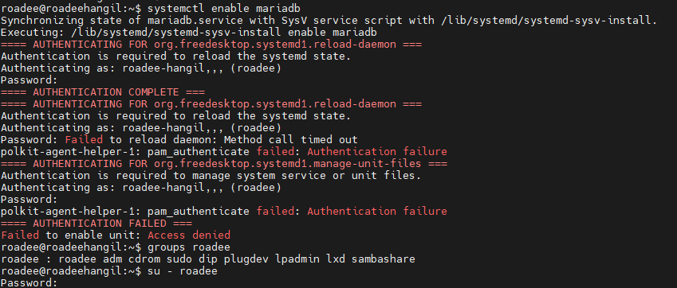

#### Step1. MariaDB 서버 설치

    sudo apt install mariadb-server

#### Step 2. 보안 정보 등록 

    sudo mysql_secure_installation  비밀 번호 랑 기타 이상 야릇한것 들 등록

#### ※만약에 아래와 같은 내용이 나온다면 

        1. Check If You Have Sudo Privileges
        Run the following command to check if your user (roadee) is in the sudo group:
        
            groups roadee
            
        If you don't see sudo in the output, you need to add your user to the sudo group:
        
            sudo usermod -aG sudo roadee
            
        Then, restart your session:
        
            su - roadee
        2. Use Sudo to Enable MariaDB
        Try running the command with sudo:
        
            sudo systemctl enable mariadb

#### STEP 3. DB 활성화 

MariaDB 활성화

        systemctl enable mariadb

MariaDB 시작

        systemctl start mariadb

MariaDB 상태 확인

        systemctl status mariadb

MariaDB 중지

        sudo systemctl stop mysql

MariaDB 재시작

        sudo systemctl restart mysql

#systemctl를 못 쓰는 상황이라면 service 명령어로 해주시면 됩니다

        sudo service mariadb start

#### Step4 . 사용자 등록 및 IP접근 허용

        mysql -u root -p

        실행 후 DB에서 아래 명령어 실행 

        -- Create a new user with access from any host
        CREATE USER 'roadee'@'%' IDENTIFIED BY '44Roadee$$';
        GRANT ALL PRIVILEGES ON *.* TO 'roadee'@'%' WITH GRANT OPTION;
        FLUSH PRIVILEGES;

#### Step5.  Check MariaDB Configuration
Ensure that MariaDB is configured to accept remote connections. This involves editing the MariaDB configuration file, typically located at /etc/mysql/my.cnf or /etc/mysql/mariadb.conf.d/50-server.cnf.

        sudo nano /etc/mysql/mariadb.conf.d/50-server.cnf
        
        bind-address = 127.0.0.1 에서 아래 내용으로 변환 

        bind-address = 0.0.0.0

 저장후 다시 재시작.

        sudo systemctl restart mariadb
        
### Step 6.  한국 시간으로 설정 하기

        cd /etc/mysql/conf.d/
        sudo nano mysql.cnf

        안에 내용 중에서 수정
         [mysqld]
        
        default-time-zone='+09:00' 을 삽입 한다.
        event_scheduler = ON 또한 삽입. --→파티셔닝을 하기 위해서

저장 후 다시 시작 
        sudo systemctl restart mariadb
        
 정확하게 저장 되었는지 확인 

        SHOW VARIABLES LIKE 'event_scheduler';
        
        SHOW VARIABLES LIKE 'time_zone';
