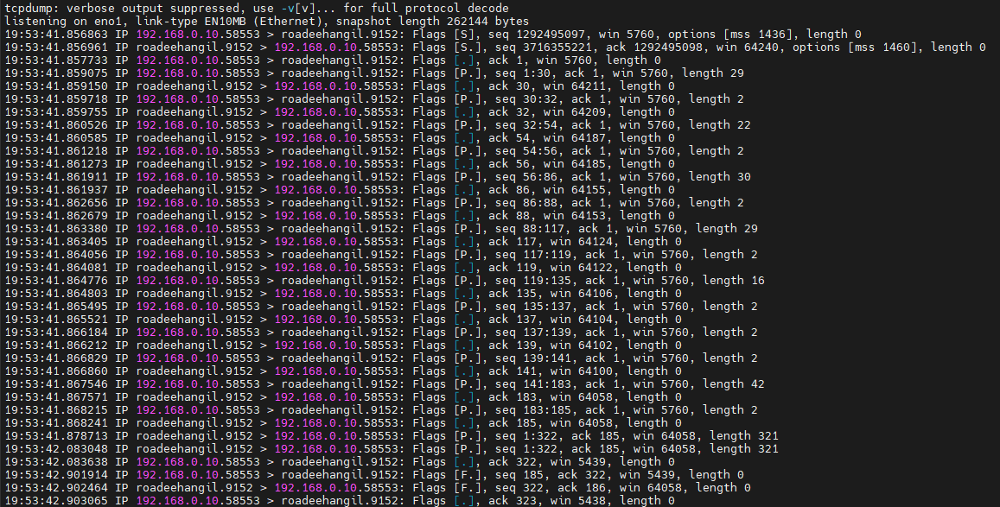

## TCP통신을 하다 보면 장치 업체 담당자들이 안된다고 연락 온다. 이럴때는 아래 내용을 참조 하여 진짜로 연결에 문제 가 없는지를 파악 하는 것이 좋다. 

### 1. TCP 패킷 캡처 툴 사용 (Wireshark, tcpdump)
서버가 HTTP 서버로 동작하지 않아도, 네트워크 인터페이스에서 수신되는 HTTP 요청 패킷은 캡처할 수 있습니다.

#### 방법: tcpdump
    
    sudo tcpdump -i <인터페이스명> port 80 -A
    예시: 유선 인터페이스가 eth0인 경우

    sudo tcpdump -i eth0 port 80 -A
    -A: 패킷 내용을 ASCII로 출력 (가독성 좋음)
    클라이언트에서 보낸 요청 헤더와 바디를 모두 확인 가능
    sudo nohup tcpdump -i any port 9152 -A > /home/roadee/logs/tcpdump/tcpdump.log 2>&1 &

 
### 2. Wireshark GUI 사용 (필요시)
        sudo apt install wireshark
        sudo wireshark
        특정 인터페이스 선택 후, 필터에 http 입력
        클라이언트 요청 패킷을 실시간으로 볼 수 있음
        
### 3. iptables 로그 남기기 (고급)
HTTP 요청을 패킷 수준에서 로깅하는 방법도 있습니다.

#### 예시
        sudo iptables -A INPUT -p tcp --dport 80 -j LOG --log-prefix "HTTP_REQUEST: "
        이후 /var/log/syslog나 /var/log/kern.log에서 로그 확인 가능
        sudo tail -f /var/log/syslog
        이 방식은 패킷 헤더 정보만 나오므로, 실제 HTTP 바디 내용은 보기 어렵습니다.

## 4.현장 예시 

        sudo tcpdump -i eno1 port 9152
        
        sudo iptables -A INPUT -p tcp --dport 9152 -j LOG --log-prefix "HTTP_REQUEST: "
        
        sudo tail -f /var/log/syslog

최종적으로 로그를 남기고 dump 의 내용을 볼려면 

우선 logs폴데에 tcpdump라는 폴저를 만들 고, shell 프로그램을 만든다. 

#### 주요 옵션
        옵션	        설명
        -i             인터페이스	특정 인터페이스 지정 (ex: enp1s0)
        -n	            호스트 이름 대신 IP 주소 표시
        -nn	            포트 이름도 숫자로 표시
        -v, -vv, -vvv	상세 정보 표시
        -w 파일명	    캡처 결과를 파일로 저장
        -c 숫자	        지정한 패킷 개수만큼 캡처 후 종료

batch 파일은 다음과 같다.

        #!/bin/bash
        
        # 로그 저장 경로 및 파일명 설정
        LOG_DIR="/home/roadee/logs/tcpdump"
        LOG_FILE="${LOG_DIR}/9152_$(date +%Y%m%d).log"
        
        # 로그 디렉터리 없으면 생성
        if [ ! -d "$LOG_DIR" ]; then
            mkdir -p "$LOG_DIR"
        fi
        
        # 기존에 실행 중인 tcpdump 프로세스 확인
        EXISTING_PID=$(ps aux | grep '[t]cpdump -i enp1s0 port 9152' | awk '{print $2}')
        
        if [ -n "$EXISTING_PID" ]; then
            echo "기존 tcpdump 프로세스 감지됨 (PID: $EXISTING_PID), 종료합니다."
            sudo kill "$EXISTING_PID"
            sleep 1
        fi
        
        # 새로운 tcpdump 실행 (백그라운드 실행 & 로그 저장)
        echo "새로운 tcpdump 프로세스 시작..."
        sudo tcpdump -i enp1s0 port 9152 -A 2>&1 | tee "$LOG_FILE" &
        
        # 실행된 tcpdump의 PID 출력
        NEW_PID=$!
        echo "새로운 tcpdump 실행됨 (PID: $NEW_PID)"
 

이름은 tcpdump9152.sh 로 만들면 된다. 

이러면 화면에 출력 하면서 로그기록이 logs file에 남게 된다. 
