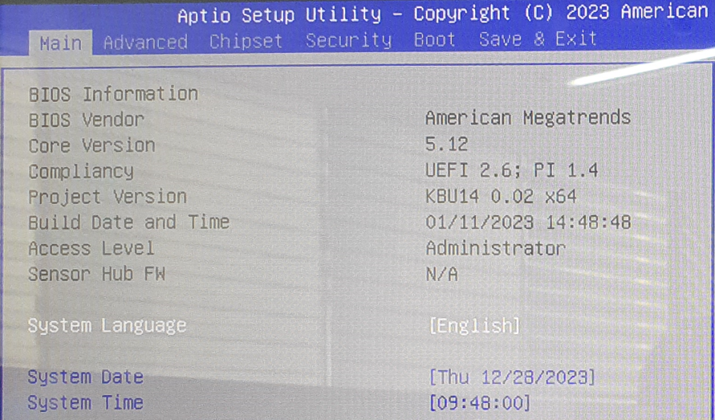

부팅을 하고 BIOS 진입을 위해서 Del키를 연타로 눌러주자...

아메리칸 메가트렌드 BIOS가 다른 BIOS에 비해서 옵션 설정이 헷갈리는 부분이 좀 많은 것 같은데... 어쨌든 진입을 하면 이런 식으로 BIOS가 나온다.

여기서 Advanced 탭에 진입을 한다. 전원 인가시 자동부팅을 설정하는 방법은 BIOS 마다 다 다르긴 한데 대부분 Advanced 탭에서 설정이 된다. 여기서 IT9786 Super IO Configuration에 진입을 한다.
